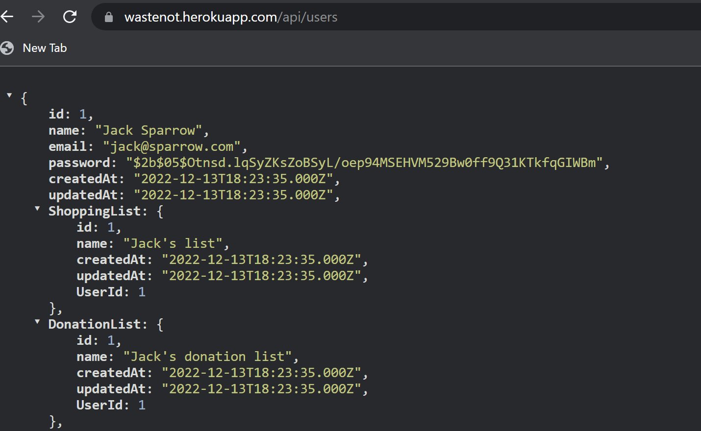

# WasteNot Kitchen Tracker

## Description

The motiviation for creating this application was to help users better organize and track products in their kitchen(s).  Users can input their kitchen locations, storage locations, and what products are in those locations.  Once this information is added, users can easily track products through the application. 

The ultimate goal is waste prevention.  This is done through encouraging users to consume products in their kitchen through the recipe search.  Or encouraging users to donate products to nearby food banks through the Google Maps search.

While creating the database and routes, the developers learned how to use MySQL and Sequelize ORM.  They gained more experience with retrieving, adding, and deleting data through GET, POST and DELETE routes.  The developers successfully deployed to Heroku and learned how to connect this API with a front end application.

## Table of Contents

- [Installation](#installation)
- [Technology](#technology)
- [Usage](#usage)
- [Screenshot](#screenshot)
- [Credits](#credits)
- [License](#license)
- [Contributing](#contributing)

## Installation

To install, fork or clone the repository from https://github.com/rachlally/feast-back-end.  Run `npm install` for package installation.  Sign into Mysql and run `source db/schema.sql/;`.  Then, seed the table at `npm run seed`.  Finally, run `node server.js` to view on the local host or Insomnia.

Link to the front-end repo at https://github.com/rachlally/feast-front-end.

## Technology 

This application is backed by a MySql database with a Sequelize ORM.  JSON Web Tokens was installed to secure information retrieval and authorization between client and server. BCrypt was installed to hash user's passwords.  Dotenv was installed to load the application's required environment variables securely.

## Usage

View the API at the deployed link: https://wastenot.herokuapp.com/.

API routes can be found in repository in the Controllers folder.

View the deployed WasteNot application at: https://wastenotkitchentracker.netlify.app/ .

## Screenshot

## Credits

A huge thank you to our TAs with the UW Coding Bootcamp.  Special thanks to Lindsay Fitzgerald for her assistance.

Developers of this application:

Andrew Massey https://github.com/amassey42

Nathan Alexander https://github.com/NathanAlexander1

Philip Schreiber https://github.com/Sullisters

Rachel Lally https://github.com/rachlally

## License

MIT License

Copyright (c) 2022 rachlally

## How to Contribute

To contribute, contact the developers through links above.

